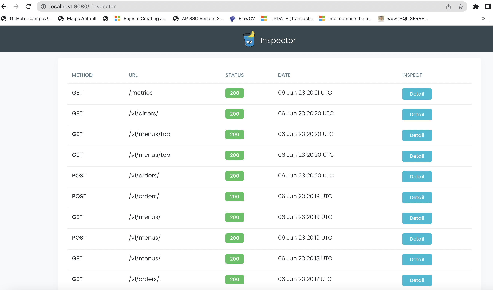

# golang-rest-api

A sample production grade REST API application written in Golang with minimal business functionalities but should have all non-functional areas covered up.

- Microservices
- Docker Containers
- REST Api + GRPC for internal Communication
- Distributed logging
- Distributed tracing
- Monitoring (grafana + Prometheus)
- Performance analysis(pprof + benchmark testing + autocannon)
- SQL database with Auto Migration and Seeding
- Debugging capacity with inspector
- Load .env files for configuration settings
- 80% Unit testing coverage
- Mocks (mockery)
- Swagger OpenApi & Markdown Docs
- ThunderClient requests for Testing APIs
- Makefile
- Docker-Compose for local running
- Enforcing Coding standards with `https://github.com/tekwizely/pre-commit-golang`

## TODO: AWS Cloud Specifics

- NoSql database
- S3 Storage
- AWS SnS/SQS
- ngrok for local dev testing
- Configurations management using SOPs & AWS KMS

## Generate Swagger documentation for the Server

- Run command `make generate`

## Test Application Server

- Run command `make test`
  
## Build Application Server

- Run command `make build`

## Run Application Server

- Run command `make run`

## Reload Application Server

- Run command `make reload`

### When we run above run or reload command, the db container and app container will be up and running then we can access APIs provided by the App

- The terminal shell looks like this

- The swagger documentation UI will be available at `http://localhost:8080/swagger/index.html`

- The PProf will be avilable at `http://localhost:8080/debug/pprof`

- The Inspector UI will be available at `hhttp://localhost:8080/_inspector`

- The metrics api will be available at `hhttp://localhost:8080/metrics`

- The Newrelic UI will look like this

- The Thunder-Client dashboard will look like this

- The docker state will look like this

- The Coding standard will be enforeced while commiting the code to the repository

